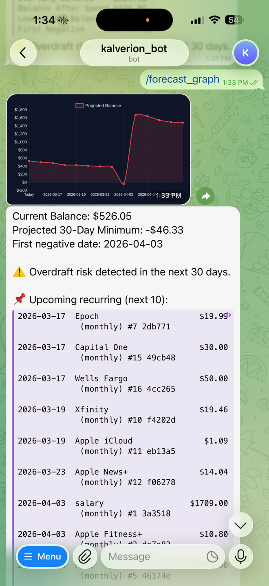

# Kalverion_bot — AI Telegram Personal Finance Bot (aka ai-bot)

Kalverion_bot is an AI-powered Telegram personal finance assistant that uses double-entry accounting, cashflow forecasting, and natural language transaction parsing to help prevent overdrafts and plan your financial future.


---

<table>
<tr>

<td width="45%" style="vertical-align:top;">

</td>

<td width="55%" style="padding-left:30px; vertical-align:top;">

## Features

🦞 Built with OpenClaw for AI-powered Telegram interaction  

📒 Double-entry accounting  

📊 Cashflow forecasting  

🔁 Recurring bills & income  

💳 Debt payoff optimization  

📈 Financial graphs  

🤖 AI transaction parsing with Natural Language  

</td>

</tr>
</table>

---

## Why I Built This

I started this project after getting hit with **overdraft fees** and realizing I had no clear view of my short-term cashflow.

Most finance apps show what already happened.  
This bot focuses on **what will happen next** — predicting your balance, warning about danger windows, and helping you avoid overdrafts before they occur.

---

# ⚡ Try it in 30 seconds

```bash
git clone https://github.com/bisbeebucky/ai-bot
cd ai-bot
npm install
node index.js
